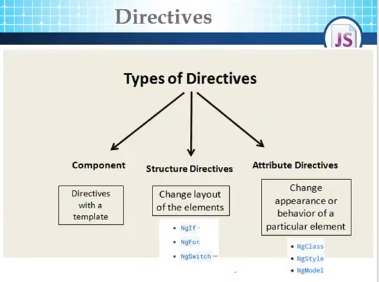

### ngFor

1- ngFor loops over a collection
`let item of collection`

2- ngFor has index variable built in
`let i = index` or `index as i`

3- ngFor has trackBy function that takes index and the current item of the collection (by default)
`trackBy: trackerFn`
```TS
trackerFn(index : number, item: IProduct) {
	// return a unique value that angular will use to mark it
	return item.id;
}
```

`trackBy` function is used to enhance performance, Angular uses the return value to use it as a unique value. That enables Angular to rerender the DOM item that has been changed only.

#### `[hidden = "expression"`

```TS
<tr *ngFor="let product of products" [hidden]="product.id==0">
```

`[hidden]` only hides the component from the DOM, it means it is exising in the dom but it's hidden
### ngIf

ngIF removes the component from the dom while rendering. So, it means that you can't access this compnent later; because it's not in the dom


